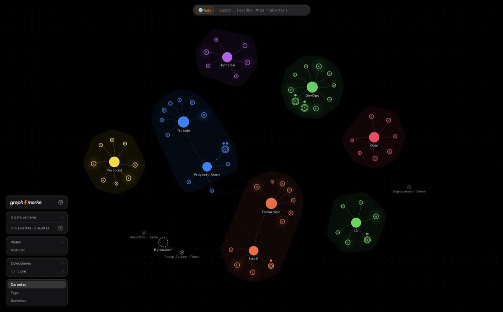
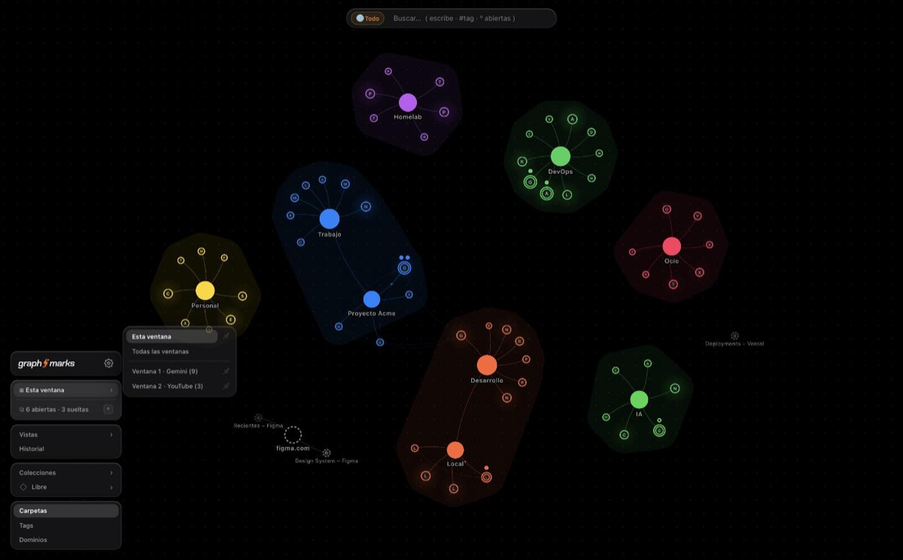
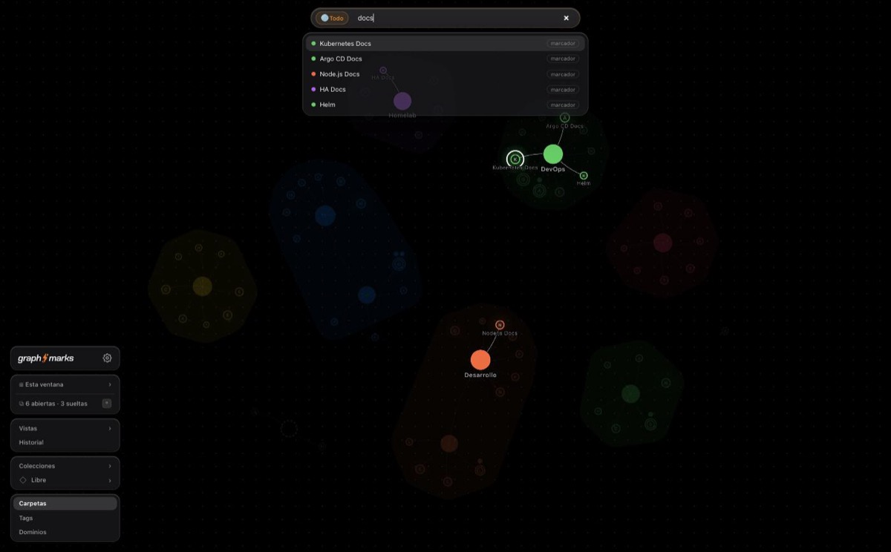
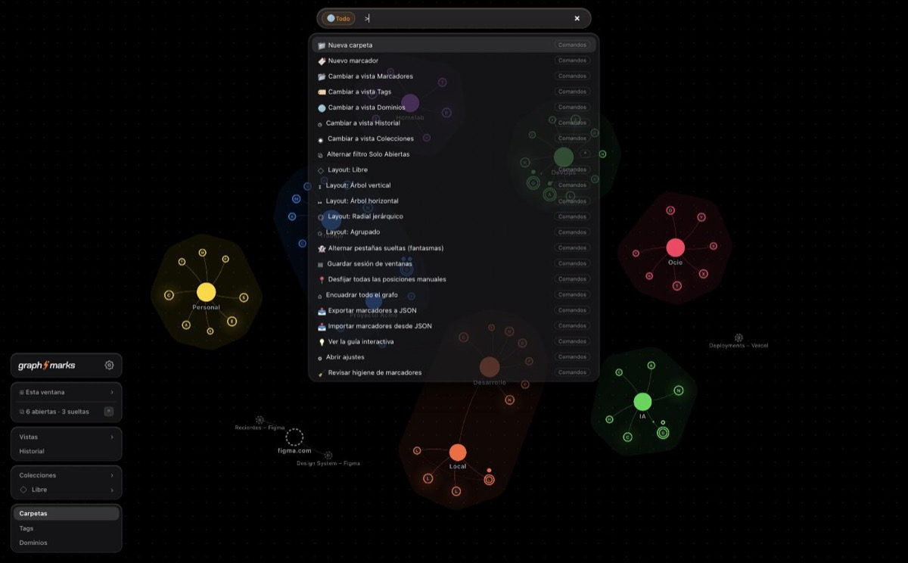
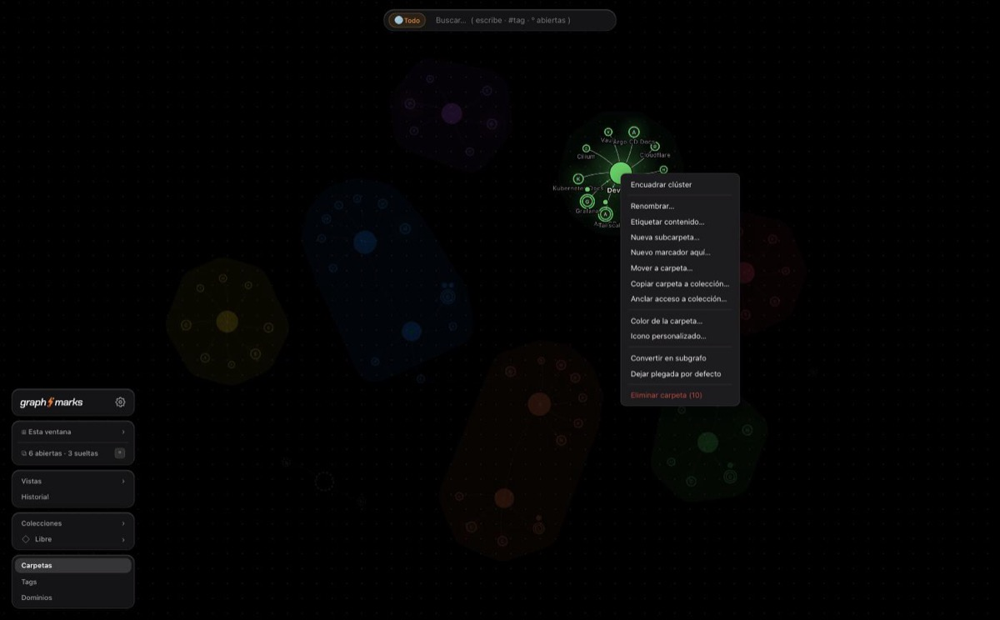
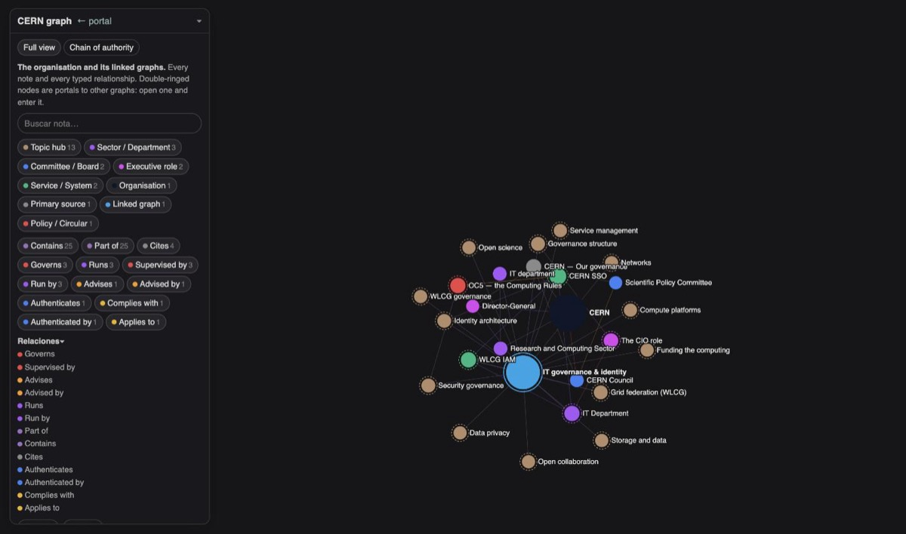
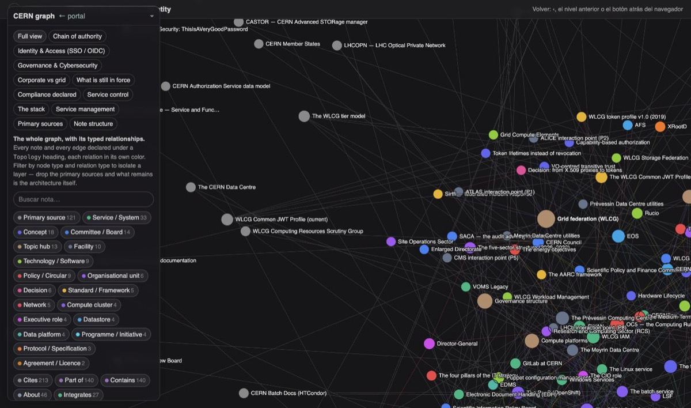

# Islas sobre el lienzo

Rehacer el HUD, el header y la gestión de ventanas del explorer de quartz-okf a partir de la interfaz de graphacker.

| | |
|---|---|
| Fecha | 30 de agosto de 2026 |
| Fuente estudiada | `~/Developer/graphacker` v0.22.1 (HEAD `1b1bdd39`), código y preview en vivo (`chrome-dev/newtab.html?demo=landing`) |
| Objeto del rediseño | `plugins/quartz-okf-explorer/src/assets/explorer.html` (1 362 líneas, JS inline) en quartz-okf `98247dd`, visto sobre cern-graph (padre) y su subgrafo `it-governance` (hijo, 290 notas) |
| Método | lectura a nivel de fichero + ejecución lado a lado en Chrome; todas las capturas del anexo son reales |
| Dónde está el trabajo | rama `002-explorer-hud` de quartz-okf (desde 001): `specs/002-explorer-hud/research.md` (D1–D12) y `spec.md` (US1–US6, FR-001..020), sin commitear |

---

## 1. Resumen ejecutivo

1. **graphacker resolvió el mismo problema que tiene el explorer** —un grafo en canvas que necesita controles sin perder el lienzo— con tres movimientos: el lienzo es la página y el chrome flota en islas; el header es una omnibar (búsqueda + ámbito + paleta de comandos); y cada control decide su estado en una función pura mientras el DOM solo reacciona.
2. **El explorer, puesto al lado, falla en lo que graphacker acierta**: un panel único que crece hasta ser un muro (en el hijo: 12 modos, un párrafo, la búsqueda, 25 tipos y 20 relaciones), que además **tapa la miga de grafos** que añadimos a propósito en 001; dos barras a todo lo ancho; búsqueda enterrada y limitada al grafo actual; sin paleta, sin teclado, sin menú contextual; textos en español dentro del motor.
3. **Se traslada la regla, no el producto.** Islas, omnibar, menús laterales, chips con decisión pura, menú contextual, teclado, tokens de vidrio y estado en la URL sí; orígenes/colecciones, layouts, ventanas del navegador, cloud y SolidJS no.
4. **Propuesta**: omnibar cuya parte izquierda ES la miga de grafos (y el ámbito de búsqueda: este grafo / todos los grafos / un subgrafo), cápsula de selección con las relaciones del nodo, pila de cuatro islas abajo-izquierda (marca · lectura · vistas · filtros), menú contextual, teclado completo, exploraciones guardadas como URL. Todo en módulos puros con `node --test`, sin framework.
5. **Quedan cuatro decisiones tuyas** (§10) antes de pasar a `/speckit-plan`; el resto está decidido en D1–D12 y no lo reabriría.

---

## 2. Método y alcance

Leí graphacker en dos capas. Estructura y estilo: `newtab.html`, `newtab.css` (1 281 líneas, tokens y todas las superficies), `panels.tsx` (montaje de islas), `hud-brand.tsx`, `windows-nav.tsx`, `tabs-badge.tsx`, `views-nav.tsx`, `source-nav.tsx`, `layout-picker.tsx`, `search.tsx`, `commands.ts`. Mecánica: `ui/{modal,menu,dismiss,toast,tour,dom,empty}.tsx`, `lib/{badge-label,view-axes,command-palette}.ts`, `interactions/{keyboard,subgraph,tooltip}.ts`, `render/{backdrop,selection,labels}.ts`. Decisiones de producto: `CLAUDE.md`, `docs/ux-colecciones.md`, `docs/layouts-del-grafo.md`, `docs/plan-remediacion-apple-floating-ui.md`.

Después compilé `chrome-dev` (`pnpm build:dev`), lo serví en `:8790` (el MCP de Chrome no abre `file://`) y lo recorrí entero: los cuatro desplegables, la búsqueda, la paleta `>`, el tooltip, el menú contextual de un hub, la lente Tags, ajustes, la guía. En una segunda pestaña, el explorer de cern-graph en `:8766`, en la raíz y dentro de `?graph=it-governance`.

Fuera de alcance: el pintado de nodos/aristas del canvas (hulls, satélites, partículas), el grafo de panel de Quartz (`quartz-graph-okf`) y el widget de acceso de las notas (`access.js`), salvo donde el header los toca.

---

## 3. Anatomía de la interfaz de graphacker

### 3.1 El lienzo es la página

- `#stage { position: fixed; inset: 0 }` y `html, body { overflow: hidden }`. Nada reserva espacio: todo lo demás flota.
- Los contenedores flotantes son `pointer-events: none` y solo sus hijos reciben entrada (`#topbar > *`, `.hud-left-stack > *`). Entre islas, el grafo sigue siendo arrastrable.
- Escalera de z-index corta y explícita: lienzo 1 · HUD 20 · resultados 25 · tooltip 50 · toast 70 · menús 95 (por encima del velo de la guía).
- Las zonas seguras se respetan una vez, en los anclajes: `top: max(16px, env(safe-area-inset-top))`, `bottom: max(20px, env(safe-area-inset-bottom))`.
- El canvas pinta su propio suelo (`render/backdrop.ts`): una malla de puntos cada 26 px, alpha .55, que se desplaza a la mitad de la velocidad del paneo, y una viñeta radial. Barato, y hace que el vacío se lea como *espacio* y no como *nada cargado*.

### 3.2 Tokens («Liquid Glass»)

Dos paletas en `:root` elegidas por `prefers-color-scheme`; todo lo demás deriva de ellas.

| Token | Claro | Oscuro | Lo usan |
|---|---|---|---|
| `--page` / `--surface-1` | `#f2f2ee` / `#fcfcfb` | `#000` / `#1c1c1e` | suelo, diálogos |
| `--text-primary/secondary/muted` | `#1d1d1f` … | `#f5f5f7` … | tres niveles de texto, ni uno más |
| `--hud-bg` (+`-hover`) | `rgba(255,255,255,.72)` | `rgba(28,28,30,.72)` | toda isla, cápsula, menú, tooltip, toast |
| `--hud-border` + `--hud-border-inner` | `rgba(0,0,0,.08)` + brillo interior | `rgba(255,255,255,.12)` + brillo | el canto del vidrio |
| `--hud-shadow` / `--hud-shadow-lg` | suave / enfocada | más profunda | reposo / foco y menús |
| `--pill-active-bg/color` | `rgba(0,0,0,.08)` | `rgba(255,255,255,.14)` | el único tratamiento de «seleccionado» |
| `--accent` | `#ff8000` | `#ff9000` | anillo de foco, píldora «Todo», punto de borrador |
| `--series-1..8` | colores de sistema Apple | | datos; nunca chrome |

Formas: `.hud-capsule` (radio 999 px) para lo de una fila; `.hud-panel` (14 px) para islas; menús 16 px; resultados 18 px. `backdrop-filter: blur(28px) saturate(190%)` en islas, `blur(36px) saturate(200%)` en menús y resultados. Una sola curva de movimiento (`cubic-bezier(0.16, 1, 0.3, 1)`, 0,2 s) y `:active { transform: scale(.96) }` en los chips. `:focus-visible` es un contorno de 2 px en el acento; nada más estiliza el foco.

### 3.3 El header es una omnibar

Una cápsula, arriba y centrada. Dentro: **píldora de ámbito** (`📍 Esta vista` / `🌐 Todo` / `📁 <colección>`; `Tab` alterna), el campo de búsqueda (320 px, crece a 440 al enfocar) y la lista de resultados que cuelga debajo (`min(560px, 88vw)`, `max-height 62vh`).

Lo que importa de `search.tsx`:

- **Escribir en cualquier sitio busca.** Cualquier tecla imprimible fuera de un input enfoca la caja y añade la tecla; `/` enfoca; `Escape` limpia y suelta el foco.
- **Entrar en búsqueda mueve la cámara y la devuelve.** `enterSearchMode` guarda `S.tf`, encuadra el grafo entero (450 ms); `exitSearchMode` vuelve con transición. El lector nunca pierde dónde estaba.
- **Los resultados mandan sobre el canvas.** La consulta construye `S.focusSet` (coincidencias + sus hubs + su padre) y el pintado atenúa el resto; la fila resaltada fija `S.searchFocusNode` y, tras 3 s de reposo, la cámara vuela hasta ella.
- **`>` es una paleta de comandos.** Misma caja, misma lista: `lib/command-palette.ts` es un registro (`id, titleKey, icon, shortcut, keywords, action`); `commands.ts` el catálogo (vistas, layouts, filtros, sesiones, exportar/importar, guía, ajustes). El buscador no conoce la aplicación: pinta y ejecuta `CommandItem`s.
- Cada fila: punto de color (del nodo, o del origen si el resultado es federado) · título · badge de tipo a la derecha (`marcador`, `carpeta`, `En: <colección>`). Los resultados de otro origen llevan un badge de otro color.
- El `blur` espera 150 ms antes de esconder la lista para que el clic sobre una fila aterrice (`BLUR_SETTLE_MS`): el idioma estándar de blur-vs-click, con nombre.

### 3.4 La pila de islas

`<aside id="hud-left-stack">`, abajo-izquierda, 215 px, `gap: 8px`, cinco islas montadas por `panels.tsx`:

| Isla | Contenido | Regla que la gobierna |
|---|---|---|
| Marca | logotipo + rueda de ajustes | siempre visible; el único sitio donde aparece el nombre del producto |
| Ventanas | chip de filtro de ventana ›, chip contador `⧉ 6 abiertas · 3 sueltas` con `<kbd>º</kbd>`, sesiones guardadas como filas con ✕ | el chip se esconde cuando no filtraría nada, salvo que la isla quedase vacía (`lib/badge-label.ts`, `winChipView`) |
| Vistas | selector de vistas guardadas › (filas con 📌, luego Guardar / Guardar como / Descartar / Renombrar / Eliminar), vistas ancladas como chips, Historial | «no hay ninguna entrada que represente *no tener vista*: eso es lo que queda cuando eliges un origen» (`views-nav.tsx`) |
| Orígenes + layout | `Colecciones ›` (composición multiselección: Marcadores primero, divisor, colecciones con 🗑, `+ Colección`), selector de layout `◇ Libre ›` (icono + etiqueta + sub) | tres ejes, en orden: origen → lente → layout (`lib/view-axes.ts`) |
| Lentes | `Carpetas · Tags · Dominios` (+ extras de la estrategia: rango del historial, solo no guardados) y `← Grafo` mientras se está en un subgrafo | las lentes son por origen y se recuerdan por origen (`LENSES_BY_SOURCE`, `lensMemory`) |

### 3.5 Mecánica común de las islas

- Una isla sin botón visible desaparece: `.hud-vertical-panel:not(:has(button:not([hidden]))) { display: none }`.
- Una sola forma de control, el **chip**: ancho completo, alineado a la izquierda, 12 px/500; `.active` recibe la píldora y peso 600; opcionales `.chip-sub` (cuenta apagada), `.chip-arrow` (›), `.chip-kbd` (atajo), `.dot` (color). Las filas con acción secundaria usan `.chip-row` / `.views-menu-row` (botón principal `flex: 1` + chincheta o ✕).
- Los desplegables se abren **al lado** de la isla (`.views-menu { position: absolute; bottom: 0; inset-inline-start: calc(100% + 8px) }`), alineados por abajo con el disparador, con scroll propio a `min(420px, 100vh - 80px)`. Nunca tapan la pila.
- Todos se cierran con clic fuera o `Escape` por una única primitiva, `ui/dismiss.ts` `onDismiss(insideRef, close)`; los disparadores llevan `aria-haspopup` y `aria-expanded`; las filas, `menuitemradio` / `menuitemcheckbox` con `aria-checked`.
- **Los chips reaccionan; nadie llama a `updateChip()`.** Texto, activo, oculto y aviso salen de una función pura sobre el estado (`badgeView`, `winChipView`) y el componente solo lo lee.

### 3.6 Gestión de ventanas

Lo que graphacker llama ventanas son ventanas del navegador; lo reutilizable es la mecánica.

- **Filtro + contador + conjuntos guardados** es la forma de la isla: *qué ventanas* (chip de filtro), *qué hay abierto* (contador que además conmuta «solo abiertas», con su atajo visible), *qué guardé* (sesiones: conjuntos con nombre que se restauran con un clic, se borran con confirmación y se guardan desde el propio menú del filtro con 📌 por fila).
- **La decisión es pura y tiene test.** `lib/badge-label.ts` devuelve `{hidden, text, active, warn}`; `warn` lleva el problema de permisos al propio chip (chip rojo «sin acceso a pestañas») en vez de a un vacío silencioso.
- **La persistencia degrada con honestidad**: los ids de ventana no sobreviven a un reinicio, así que el filtro guardado colapsa a `current` (`tabs.ts`, `setWinFilter`), documentado como límite.
- **Un solo `<dialog>` para todos los modales** (`ui/modal.tsx`): montar uno desmonta el anterior; `DialogSpec` sigue siendo la frontera para que los llamadores construyan formularios sin JSX. Los anchos (ajustes maestro-detalle, recorrido del historial) son una clase sobre el mismo host.
- **Un solo elemento de menú contextual** (`ui/menu.tsx`): items como datos (`label, action, danger, sep`), clamped al viewport, cierre por clic fuera/Escape; `Space` sobre un nodo con foco de teclado lo abre en la posición del nodo.
- **Toasts persistentes** (decisión de producto, agosto 2026): cápsula abajo-derecha con punto, mensaje, acción opcional (Deshacer) y ✕. Sin temporizador.
- **Motor de guía** (`ui/tour.tsx`): pasos como datos (`title, body, target(), onEnter, hero`); un foco recortado sigue al objetivo mientras el grafo se mueve. La guía *conduce* la app (cambia de lente, encuadra un clúster) en vez de describirla.

### 3.7 Subgrafos, menú contextual y teclado

- Un hub de carpeta se convierte en subgrafo desde su menú contextual (`interactions/subgraph.ts`, preferencia en `folderPrefs`); `Enter` o doble clic lo abre, `rebuildAround` reconstruye y encuadra a los miembros; la isla de lentes muestra `← Grafo` (chip activo) para salir. El tooltip del hub dice cómo entrar. Es la misma forma que ya tiene el explorer para los portales; graphacker solo pone la *salida* en la isla.
- Menú contextual sobre un hub (capturado): Encuadrar clúster · Renombrar · Etiquetar contenido · Nueva subcarpeta · Nuevo marcador aquí · Mover a carpeta · Copiar carpeta a colección · Anclar acceso a colección · Color · Icono · Convertir en subgrafo · Dejar plegada por defecto · Eliminar carpeta (10). Es el gesto más usado del producto.
- `interactions/keyboard.ts`: `Tab`/`Shift+Tab` recorren nodos en orden estable, las flechas saltan al nodo más cercano en esa dirección (`lib/spatial-nav.ts`, puro), `Enter` activa (abrir / seguir portal / abrir subgrafo / desplegar), `Space` abre el menú, `Escape` suelta el foco. Todo se ignora mientras se escribe o hay un diálogo o menú abierto. El nodo con foco conserva su etiqueta y lleva anillo.

### 3.8 Reglas de arquitectura que lo mantienen sano

- `lib/**` es puro y es lo único con tests unitarios y puntuación de mutación; `ui/**` no importa dominio; el dominio no importa al orquestador (pasa por `bus.ts`).
- Estado en dos niveles: los campos de aplicación son señales reactivas; los calientes (`nodes`, `tf`, `hover`) son planos porque d3 los muta a 60 fps; las lecturas derivadas declaran su dependencia con `graphVersion()`.
- Cero texto visible en código: `t(key)` sobre `locales/{es,en,…}.json` (siete catálogos).
- Cada superficie descartable usa la misma primitiva; cada modal el mismo host; cada chip la misma clase. Añadir una isla es HTML + un componente.

### 3.9 Lo que graphacker no ha resuelto

Del backlog de `plan-remediacion-apple-floating-ui.md`: **12 `backdrop-filter` flotando sobre un canvas a 60 fps sin medir en una máquina modesta con un grafo grande**; el atajo `º` depende del teclado español; la búsqueda federada es O(todos los items) por tecla. El primero nos afecta directamente (D12).

---

## 4. El explorer hoy, visto al lado

De la comparación en vivo (cern-graph, raíz y `?graph=it-governance`):

1. **El panel es un muro.** En el hijo, el panel abajo-izquierda lista 12 píldoras de modo, un párrafo de ayuda, la búsqueda, 25 píldoras de tipo y 20 de relación antes de llegar a la leyenda y a los botones; crece hasta la altura del viewport.
2. **El panel tapa la miga de grafos.** Con esa altura se superpone a la barra del trail (`#panel { max-height: calc(100% - 1.8rem) }` contra `#topbars` en `top: 0`): el rastro `‹ CERN graph › CERN IT Governance…` —lo que FR-016 añadió a propósito— solo se ve con el panel plegado. Un bug de apilado, y sobre todo un layout que no puede alojar las dos cosas.
3. **Dos barras a todo lo ancho.** Trail y barra de relaciones son tiras `left:0; right:0` con borde y fondo translúcido; se comportan como chrome de página, no como HUD.
4. **La búsqueda está enterrada** en el panel, la tercera cosa desde arriba, y solo busca en el grafo actual: desde el padre no hay forma de encontrar una nota del subgrafo montado (272 de las 290 páginas montadas no están en el grafo del padre).
5. **Sin superficie de comandos, sin modelo de teclado, sin menú contextual.** Encajar, Limpiar y el chevrón de plegado son botones; el único atajo es `Escape` en la caja de búsqueda.
6. **Los textos viven en el motor** (`Buscar nota…`, `Encajar`, `Limpiar`, `Explorar subgrafo ↘`, `Volver: ‹, el nivel anterior…`) en español, sea cual sea el idioma del consumidor. No es vocabulario de dominio (no viola el principio IV), pero es la misma clase de problema que graphacker resolvió con catálogos.
7. **La cámara es del lector**, principio declarado en el README del explorer — y es correcto. graphacker mueve la cámara al buscar y la restaura; el explorer respeta al lector en cuanto tocó la cámara (`?focus=`, `fit`). Se conserva.
8. **El dock de lectura ya es un gestor de ventanas** (pestañas, temporal vs fijada, un frame por pestaña, abrir en pestaña nueva, cerrar) sin representación en el HUD: con el dock cerrado nada dice que hay tres notas abiertas.

---

## 5. Qué se traslada, qué se adapta, qué se queda fuera

| graphacker | Explorer (propuesta) | Tipo |
|---|---|---|
| Lienzo a sangre + islas `pointer-events` | Igual; el dock de lectura sigue siendo columna (es contenido, no chrome) | traslado |
| Tokens de vidrio, dos temas | `--okf-hud-*` sobre el par `light-dark()` que ya existe; alternativa plana | traslado |
| Omnibar con píldora de ámbito | Omnibar cuya izquierda es **la miga de grafos** = el ámbito (este grafo / todos / un subgrafo) | adaptación |
| Escribir en cualquier sitio, `/`, `Escape`, cámara guardada/restaurada, atenuación por consulta, vuelo tras reposo | Igual (la atenuación por `query` ya existe) | traslado |
| Paleta `>` con registro puro | Igual + comandos declarados por el consumidor como datos en `okf.config.mjs` | traslado |
| Isla de ventanas / sesiones | **Isla de lectura**: notas abiertas, fijadas, `⌘W`, exploraciones guardadas (nombre + URL) | adaptación |
| Isla de lentes + `← Grafo` | **Isla de vistas**: los modos del consumidor; dentro de un subgrafo, los del hijo tras `‹ Volver a <padre>` | adaptación |
| Menús laterales `menuitemcheckbox` | **Isla de filtros**: `Tipos › (25)`, `Relaciones › (20)`, leyenda bajo demanda, stats como pie | adaptación |
| — | **Cápsula de selección** (tipo · título · relaciones agrupadas · acciones) | propio |
| Menú contextual, `Space` | Igual (abrir, fijar, encuadrar vecindad, solo este tipo/relación, entrar, copiar enlace) | traslado |
| Teclado (`lib/spatial-nav`) | Igual, portado como módulo puro con tests | traslado |
| Chips con decisión pura (`badge-label`) | Cada chip: `chipView(state) → {hidden,text,active,warn}` con `node --test` | traslado |
| Un `<dialog>`, un menú, `onDismiss` | Igual | traslado |
| Malla de puntos + viñeta | Igual, con interruptor plano | traslado |
| Orígenes / colecciones / composición | — (un corpus por sitio) | fuera |
| Selector de layout | — (un layout; los modos ya cambian de grafo) | fuera |
| Ventanas del navegador, pestañas, fantasmas | — | fuera |
| Cloud, cuentas, cobro, telemetría | — | fuera |
| SolidJS | — (salvo decisión en contra, §10) | fuera |
| Toasts persistentes | — (no hay operaciones deshacibles; basta un «Enlace copiado» transitorio) | fuera |

---

## 6. Las doce decisiones

Cada una: qué se decide y por qué. Todo el vocabulario sigue siendo configurable (principio IV) y cada decisión de chip es una función pura bajo `src/lib/` del plugin con `node --test` (principio III).

**D1 — El lienzo es la página; el chrome flota.** `#wrap` a sangre; cada control es isla o cápsula; contenedores `pointer-events: none`. El muro y el solapamiento del trail nacen de reservar espacio. Rechazado: sidebar al estilo Quartz, toolbar superior.

**D2 — La omnibar: miga a la izquierda, búsqueda a la derecha.** Una cápsula arriba-centro. Izquierda: la miga de grafos como pila de píldoras (`CERN graph › IT governance`, niveles anteriores clicables, actual en negrita) que a la vez es el ámbito de búsqueda; en la raíz colapsa al título del sitio. Ámbito con tres valores: *este grafo*, *todos los grafos* (raíz + cada `static/okf-subgrafos/*.json`, resultados con badge del subgrafo, entrar al activar), *un subgrafo*. `Tab` alterna. Saca el trail de la sombra del panel para siempre. Rechazado: trail como barra aparte encima de la omnibar (dos headers).

**D3 — `>` abre una paleta en la misma caja.** Registro `{id, label, icon, shortcut, keywords, run}` que llena el motor (modos, encajar, limpiar filtros, etiquetas/leyenda, entrar/salir del subgrafo, abrir/fijar/cerrar nota, copiar enlace, dock) y amplía el consumidor desde `okf.config.mjs` (`explorer.commands`, datos). Elimina la fila de botones y hace todo alcanzable por teclado sin inventar acordes.

**D4 — La barra de relaciones pasa a ser una cápsula de selección.** Con un nodo seleccionado, bajo la omnibar: punto de tipo · título · chips de relación agrupados por etiqueta · acciones (`Abrir`, `Fijar`, `Explorar subgrafo ↘` en portales). Es la única superficie que habla de *un* nodo; el tooltip queda para el hover. graphacker no tiene equivalente porque los marcadores no tienen relaciones tipadas; es lo distintivo del explorer y merece isla, no tira.

**D5 — La pila izquierda: marca · lectura · vistas · filtros.** (1) Marca: `title` del consumidor, enlace `backTo`, ajustes (etiquetas, leyenda; el tema sigue al sistema). (2) Lectura: chip `⧉ N abiertas · M fijadas` que abre el dock; fila por nota fijada (título, ✕); `Cerrar todas`; oculta si no hay nada abierto. (3) Vistas: los modos como chips, con el `desc` en un popover ⓘ y no como párrafo; dentro de un subgrafo, los modos del hijo precedidos de `‹ Volver a <padre>` (chip activo, como `← Grafo`). (4) Filtros: `Tipos ›` y `Relaciones ›` como menús laterales con punto, cuenta y checkbox, `Todos / Ninguno`; la leyenda del modo, arriba del menú de relaciones; la línea de stats (`26 nodos · 72 aristas`) como pie de la isla. Es el contenido del explorer de 001 reagrupado por pregunta —qué tengo abierto, qué estoy mirando, qué hay en pantalla— en vez de por widget. Rechazado: islas de orígenes/layout, isla de historial.

**D6 — Clic derecho es el menú del nodo; `Space` lo abre desde el teclado.** Un elemento, items como datos: abrir, abrir en pestaña nueva, fijar, encuadrar vecindad, solo este tipo, solo esta relación, entrar (portales), copiar enlace. Clic derecho en el fondo: encajar, limpiar filtros, etiquetas. Cada item es también comando de la paleta: nada es solo-menú.

**D7 — Modelo de teclado portado entero.** `Tab`/`Shift+Tab`, flechas espaciales, `Enter`, `Space`, `Escape`; suspendido mientras se escribe o hay menú abierto. Nodo con foco: anillo + etiqueta. `spatial-nav` como módulo puro con tests.

**D8 — El dock de lectura como ventanas gestionadas.** Se mantiene el dock (columna derecha; pantalla completa bajo 900 px) pero sus ventanas son de primera clase: la isla de lectura las refleja, `⌘/Ctrl+W` cierra la activa, temporal-vs-fijada se conserva (pestaña en cursiva = temporal), `Ampliar` y `Cerrar` en la cabecera. El modal de `access.js` no se toca: ya es un host único (un elemento, iframe sustituido al abrir, scroll secuestrado). Rechazado: ventanas flotantes arrastrables sobre el canvas (pelearían con el grafo por el puntero y con las islas por las esquinas).

**D9 — Exploraciones guardadas = sesiones y vistas de graphacker, sin cuenta.** Todo el estado del HUD es una URL (`?graph=&mode=&types=&edges=&focus=&pins=`), compartible copiando la dirección (`Copiar enlace` en paleta y menú); `Guardar exploración…` guarda nombre + URL en `localStorage` y las lista en la isla de lectura como filas con ✕. Sin servidor (principio I: nada autoral fuera de git; son preferencias del lector). Los lectores de PAFE y CERN quieren «la vista que te enseñé» más que sesiones personales; la URL es la forma portable y convierte cada estado del HUD en un par `stateFromUrl` / `urlFromState` testeable.

**D10 — Textos por catálogo, idioma del consumidor.** Las cadenas del motor pasan a `src/locales/{es,en}.json`; el emitter elige por `explorer.locale` (por defecto, el `<html lang>` del sitio); el consumidor puede sobreescribir cualquier clave. Cero texto visible en el código del motor.

**D11 — Substrato: módulos TypeScript empaquetados por tsup, sin framework** *(recomendación, abierta en §10)*. Partir el script inline de `explorer.html` en `src/explorer/*.ts`: `lib/` puro (vistas de chip, estado↔URL, navegación espacial, matching de comandos, ranking de búsqueda, ámbito federado) con `node --test`; `hud/` cáscaras DOM; `canvas/` pintado; empaquetado por el tsup que el plugin ya tiene en `explorer.js` e incrustado en el asset al emitir, exactamente como hoy se incrusta la configuración. Los chips se repintan desde un store mínimo (`set(state) → render()`). Lo que gana graphacker es la *regla* (decisión pura, DOM reacciona), no Solid; Solid metería un plugin de Babel en cada `quartz plugin install` de los consumidores y un runtime que el asset no necesita para ~15 chips. Alternativa viva: SolidJS si el dock crece hasta formularios reales (anotaciones, comentarios).

**D12 — Suelo y movimiento.** Malla de puntos con parallax a media velocidad y viñeta suave; la única curva de movimiento y el `:active` de los chips; `backdrop-filter` en islas con conmutador a superficies planas bajo `prefers-reduced-transparency` o por configuración del consumidor. Responde al backlog no resuelto de graphacker (12 blurs sobre un canvas a 60 fps) antes de que muerda con 300 notas en un portátil modesto.

---

## 7. El HUD propuesto

```
┌───────────────────────────────────────────────────────────────────────────────┬──────────────────┐
│                     ╭─────────────────────────────────────────────╮            │  ▣ CERN SSO  ✕   │
│                     │ CERN graph › IT governance │ Buscar…   ⇥ ámbito │            │  ▢ WLCG IAM (temp)│
│                     ╰─────────────────────────────────────────────╯            │──────────────────│
│            ╭──────────────────────────────────────────────────────────╮         │                  │
│            │ ● Grid federation (WLCG) · Contains ×18 · Part of ×3      │         │   (página de la  │
│            │   Abrir   Fijar   Explorar subgrafo ↘                     │         │    nota, iframe) │
│            ╰──────────────────────────────────────────────────────────╯         │                  │
│                                                                                 │                  │
│                          ·   ·   ·   (lienzo a sangre, malla de puntos)  ·      │                  │
│                                                                                 │                  │
│  ╭────────────────────────╮                                                     │                  │
│  │ CERN graph   ← inicio ⚙│  marca                                              │                  │
│  ╰────────────────────────╯                                                     │                  │
│  ╭────────────────────────╮                                                     │                  │
│  │ ⧉ 3 abiertas · 1 fijada│  lectura (solo si hay algo abierto)                 │                  │
│  │ 📌 CERN SSO          ✕ │                                                     │                  │
│  │ ▤ Auditoría CIS v8   ✕ │  exploraciones guardadas                            │                  │
│  ╰────────────────────────╯                                                     │                  │
│  ╭────────────────────────╮                                                     │                  │
│  │ ‹ Volver a CERN graph  │  vistas (dentro del hijo: sus modos)                │                  │
│  │ Full view            ⓘ │                                                     │                  │
│  │ Chain of authority     │                                                     │                  │
│  │ Identity & Access      │  …                                                  │                  │
│  ╰────────────────────────╯                                                     │                  │
│  ╭────────────────────────╮   ╭──────────────────────────╮                      │                  │
│  │ Tipos            25  › │ ─▶│ ☑ ● Primary source   121 │  menú lateral        │                  │
│  │ Relaciones       20  › │   │ ☑ ● Service / System  33 │                      │                  │
│  │ 290 nodos · 812 aristas│   │ ☐ ● Concept           18 │                      │                  │
│  ╰────────────────────────╯   ╰──────────────────────────╯                      │                  │
└───────────────────────────────────────────────────────────────────────────────┴──────────────────┘
```

Por zonas:

- **Omnibar (arriba-centro).** Izquierda: la miga de grafos como píldoras (cada nivel anterior, un botón); en la raíz, el título del sitio. Derecha: búsqueda; los resultados cuelgan debajo con punto de tipo, badge de clase y, si vienen de otro grafo, badge del subgrafo. `>` cambia a paleta. `Tab` alterna el ámbito.
- **Cápsula de selección (bajo la omnibar).** Solo con nodo seleccionado. Chips de relación agrupados por etiqueta; clic en un chip selecciona el destino.
- **Pila izquierda (abajo).** Cuatro islas; las vacías no se pintan; los menús se abren al lado, alineados por abajo; clic fuera o `Escape` cierran.
- **Dock de lectura (derecha).** Como hoy, con `Ampliar`/`Cerrar` en cabecera y `⌘W`.
- **Menú contextual y teclado.** Sobre cualquier nodo; sobre el fondo, acciones globales.
- **Móvil (<900 px).** Dock a pantalla completa cuando se abre; pila más estrecha; menús hacia arriba si no hay sitio; omnibar a ancho completo.
- **Dentro del modal de las notas.** El explorer detecta que está enmarcado y oculta su enlace de vuelta (la barra del modal ya tiene `Ampliar`/✕).

Lo que **no cambia**: la cámara nunca se recentra sola una vez tocada; `?focus=` y `?graph=` siguen funcionando; el historial del navegador y el trail de 001 se conservan; el motor no nombra consumidor, dominio, tipo ni etiqueta.

---

## 8. Plan: historias, requisitos y criterios de éxito

Borrador completo en `specs/002-explorer-hud/spec.md`. Resumen:

| Prioridad | Historia | Prueba independiente |
|---|---|---|
| P1 | **Orientarse desde un HUD flotante** (islas, omnibar con miga, filtros plegados, islas vacías ausentes) | raíz e hijo a 1440×900 y 390×844: nada se solapa; el trail se lee en el hijo; plegar islas no mueve el lienzo |
| P1 | **Encontrar y hacer cualquier cosa desde la omnibar** (escribir en cualquier sitio, ámbito, resultados federados, paleta `>`) | desde el padre, buscar una nota del hijo no previsualizada → aparece con badge → `Enter` entra con la nota seleccionada y el trail actualizado; `>fit` encaja |
| P2 | **Gestionar las notas abiertas** (isla de lectura, `⌘W`, ampliar, cerrar todas) | abrir 3, fijar 1, cerrar el dock → `3 abiertas · 1 fijada`; fila fijada reabre el dock; `Cerrar todas` oculta la isla |
| P2 | **Cápsula de selección y menú contextual** | seleccionar un portal → `Contains ×18` + Explorar; clic derecho → `Solo este tipo` deja un tipo marcado |
| P3 | **Teclado** | con la omnibar sin foco, `Tab`×5 + `Enter` abre una nota; `Escape`×2 suelta el foco |
| P3 | **Guardar y compartir una exploración** | filtrar a dos tipos en el hijo, fijar una nota, copiar el enlace, abrirlo en privado: mismo estado |

Requisitos clave (de FR-001..020): lienzo a viewport completo y chrome flotante (FR-001/002); miga como ámbito (FR-003); búsqueda en todos los grafos con badge y entrada (FR-004); escribir-en-cualquier-sitio, `/`, `Escape` con cámara restaurada (FR-005); paleta con comandos del motor y del consumidor (FR-007); modos como chips con descripción bajo demanda y chip de vuelta dentro del hijo (FR-008); tipos y relaciones en menús con cuenta y checkbox (FR-009); isla de lectura y `⌘W` (FR-010); cápsula de selección (FR-011); menú contextual = comandos (FR-012); teclado (FR-013); estado ↔ URL (FR-014); **cada chip decide en función pura con test** (FR-015); catálogos `es`/`en` (FR-016); tokens con alternativa plana (FR-017); garantías de 001 preservadas (FR-018); motor sin vocabulario (FR-019); sin peticiones más allá de los JSON publicados (FR-020).

Criterios de éxito medibles: sin solapamientos ni trail oculto en ambos corpus y tamaños (comprobado por cajas en el arnés de tests); entrar y salir de un subgrafo en ≤ 2 acciones desde cualquier superficie; paseo completo sin puntero; una nota que solo existe en el hijo se alcanza desde el padre con una consulta y una activación; el enlace reproduce el estado en el 100 % de los casos del round-trip; toda decisión en módulos puros; interacciones del HUD dentro de un frame a 60 Hz con blur activo sobre el hijo de 290 notas, y la alternativa plana elimina cualquier regresión medida.

Orden sugerido de implementación: tokens + lienzo a sangre + islas (P1) → omnibar con miga y ámbito federado (P1) → isla de lectura y dock (P2) → cápsula y menú (P2) → teclado → URL/exploraciones → catálogos. Cada paso empieza por sus tests puros (constitución III) y se valida en cern-graph con `./okf/build-site.sh`.

---

## 9. Riesgos y mitigaciones

| Riesgo | Mitigación |
|---|---|
| Blur sobre canvas a 60 fps en máquinas modestas (el backlog abierto de graphacker) | conmutador plano desde el primer día (D12); medir con el hijo de 290 notas antes del bump de ref |
| Búsqueda en todos los grafos = cargar N JSON de subgrafos | carga perezosa al cambiar de ámbito; caché por URL (ya existe `CACHE_GRAFOS`); el ámbito «todos» solo aparece si hay subgrafos publicados |
| Partir un fichero de 1 362 líneas de JS inline | test de caracterización del explorer actual antes de tocar nada (constitución III); el arnés `test/assemble.js` ya monta el layout de consumidor |
| Los iframes del dock no son controlables por teclado desde el HUD | los atajos de ventana (`⌘W`, fijar) se capturan en el documento del explorer, no dentro del iframe; documentado como límite |
| Catálogos: un consumidor con idioma no cubierto | sobreescritura por clave en `okf.config.mjs`; `en` como fallback con warning en build (principio V) |
| Solapamiento con 001 aún sin mergear (#3) | la rama 002 nace de 001; se rebasa sobre main cuando #3 entre; ningún cambio de 002 toca `core/` |

---

## 10. Decisiones pendientes

1. **Substrato.** Módulos TypeScript + tsup sin framework (recomendado: la ganancia es la regla «decisión pura, DOM reacciona»; Solid añadiría Babel a cada `quartz plugin install` de los consumidores) **o** SolidJS por paridad con graphacker.
2. **El modal de `access.js`** (el que abre el explorer desde una nota): ¿adopta también las islas, o solo el explorer de dentro?
3. **Exploraciones guardadas en v1**: `localStorage` + URL (recomendado) **o** solo URL.
4. **Suelo**: malla de puntos y viñeta por defecto (recomendado) **o** opt-in por consumidor.

Con esas cuatro respuestas, `/speckit-plan` y `/speckit-tasks` sobre la rama `002-explorer-hud`.

---

## Anexo C. Maqueta interactiva

`mock/hud.html` — un solo fichero, sin dependencias más allá de las fuentes de Google.
Para verlo:

```bash
cd specs/002-explorer-hud/mock && python3 -m http.server 8791
# http://127.0.0.1:8791/hud.html
```

No es el explorer: es una maqueta que implementa el HUD propuesto sobre datos reales de
los dos corpus (26 nodos del padre con sus 9 tipos y 13 relaciones; 66 del hijo con sus
19 tipos, 12 relaciones y los 12 modos), con una simulación de fuerzas propia de 40
líneas. Sirve para discutir la interfaz, no para medir rendimiento.

Qué se puede probar:

| Gesto | Qué demuestra |
|---|---|
| Escribir en cualquier sitio, o `/` | La omnibar toma las teclas (D2) |
| `⇥` en la omnibar | Cambia el ámbito: este grafo ↔ todos los grafos |
| Buscar `token` con ámbito «todos» desde la raíz | Las tres notas del hijo aparecen con su badge; activarlas **entra** en el subgrafo (D2, FR-004) |
| `>` en la omnibar | Paleta de comandos (D3) |
| Clic en un nodo | Cápsula de selección con las relaciones agrupadas + dock de lectura (D4, D8) |
| Doble clic en el portal, o `Explorar subgrafo ↘` | Entra en el hijo: sus 12 modos, sus 19 tipos, su miga (D2, D5) |
| `Tipos ›` / `Relaciones ›` | Menús laterales con cuenta y checkbox; el lienzo responde (D5) |
| Clic derecho en un nodo o en el fondo | Menú contextual (D6) |
| `⌘W` | Cierra la ventana activa (D8) |
| Botón **Anatomía** | Superpone la numeración de las piezas del HUD |
| Botones **Claro** / **Plano** | Los dos temas y la alternativa sin desenfoque (D12, FR-017) |

Lo que la maqueta **no** trae, a propósito: teclado espacial (D7), estado en la URL (D9),
catálogos de idioma (D10) y las exploraciones guardadas. Son requisitos de la spec, no
piezas visuales que discutir.

## Anexo A. Ficheros consultados en graphacker

`newtab.html` · `newtab.css` · `src/panels.tsx` · `src/hud-brand.tsx` · `src/windows-nav.tsx` · `src/tabs-badge.tsx` · `src/views-nav.tsx` · `src/source-nav.tsx` · `src/layout-picker.tsx` · `src/search.tsx` · `src/commands.ts` · `src/ui/modal.tsx` · `src/ui/menu.tsx` · `src/ui/dismiss.ts` · `src/ui/toast.tsx` · `src/ui/tour.tsx` · `src/ui/dom.ts` · `src/ui/empty.tsx` · `src/ui/legend.tsx` · `src/lib/badge-label.ts` · `src/lib/view-axes.ts` · `src/lib/command-palette.ts` · `src/interactions/keyboard.ts` · `src/interactions/subgraph.ts` · `src/interactions/tooltip.ts` · `src/render/backdrop.ts` · `src/render/selection.ts` · `src/render/labels.ts` · `src/locales/es.json` · `CLAUDE.md` · `docs/ux-colecciones.md` · `docs/layouts-del-grafo.md` · `docs/plan-remediacion-apple-floating-ui.md` · `scripts/smoke-ui.mjs`.

En quartz-okf: `plugins/quartz-okf-explorer/src/assets/explorer.html`, `access.js`, `src/index.ts`, `README.md`; `.specify/memory/constitution.md`; `docs/METHODOLOGY.md`.

## Anexo B. Capturas

Reales, tomadas el 30 de agosto de 2026 (1 200 px de ancho), en `img/`.

**graphacker en reposo** — omnibar arriba, pila de cinco islas abajo-izquierda, hulls por
carpeta, malla de puntos.



**Isla de ventanas abierta** — Esta ventana / Todas / Ventana 1 · Gemini (9) / Ventana 2 ·
YouTube (3), 📌 por fila; el menú se abre al lado de la isla, no encima.



**Búsqueda «docs»** — resultados con punto de color y badge; el grafo se atenúa salvo las
coincidencias y sus hubs; el resultado resaltado lleva anillo en el canvas.



**Paleta `>`** — 22 comandos con icono, atajo y categoría, en la misma caja del buscador.



**Menú contextual de un hub** (DevOps): 13 acciones más eliminar, incluida «Convertir en
subgrafo».



**Explorer de cern-graph, raíz** — panel desplegado: 2 modos, ayuda, búsqueda, 9 tipos,
14 relaciones y leyenda.



**Explorer dentro de `it-governance`** — el panel de 12 modos + 25 tipos + 20 relaciones
tapa la miga de grafos: del `‹ CERN graph › CERN IT Governance & identity` solo asoma
«…ntity» y la pista de la derecha. Es la prueba visual del defecto §4.2.


